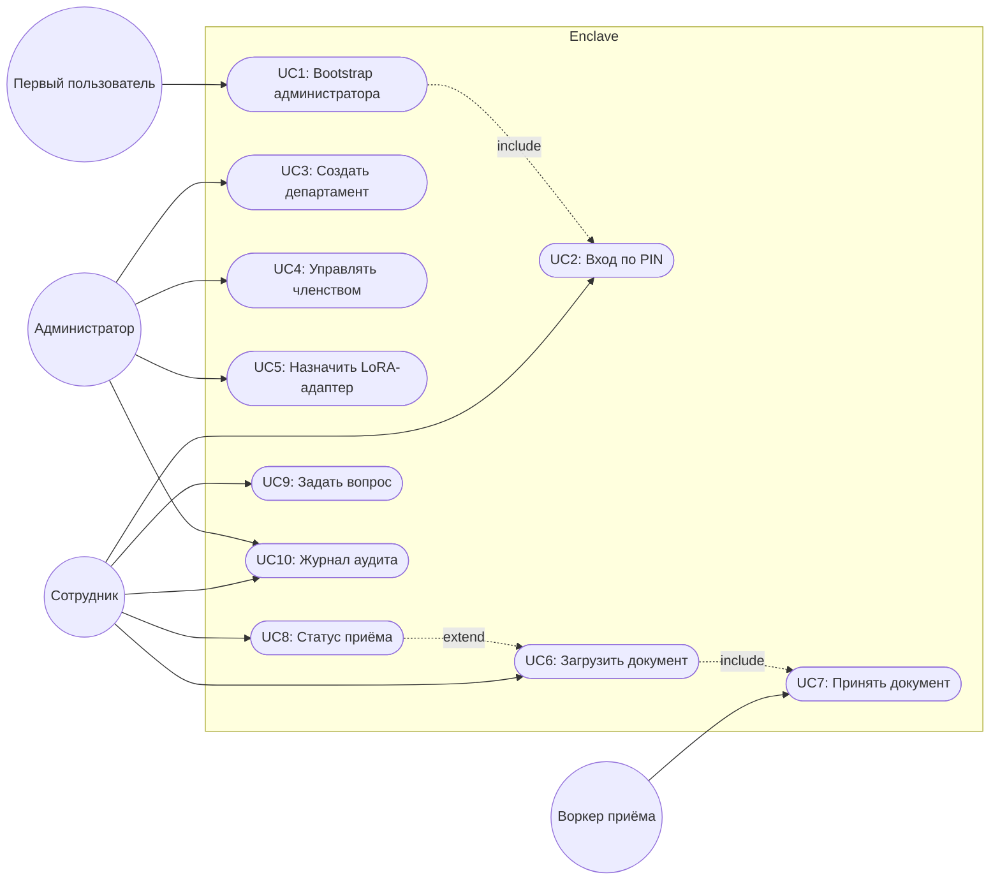
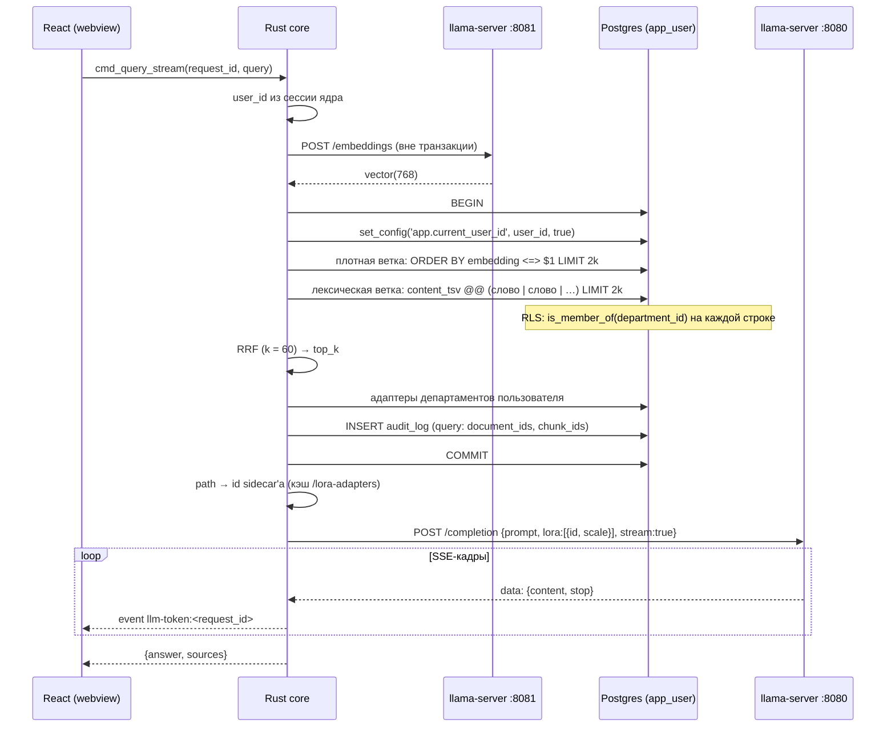
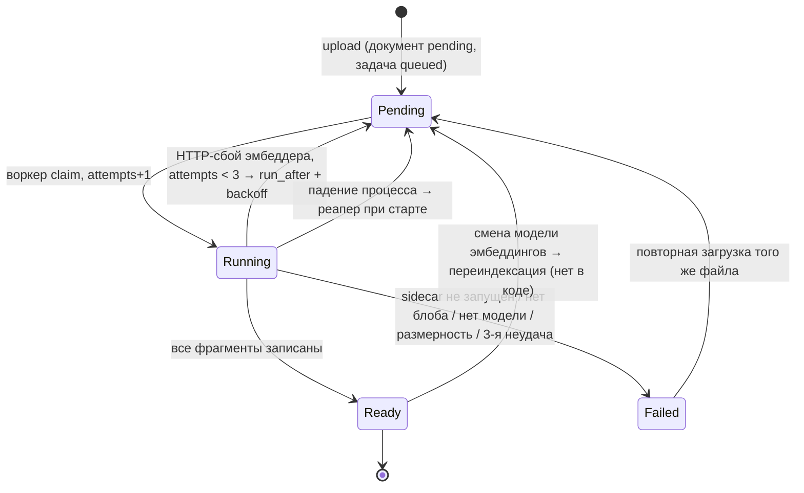
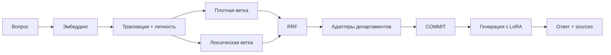
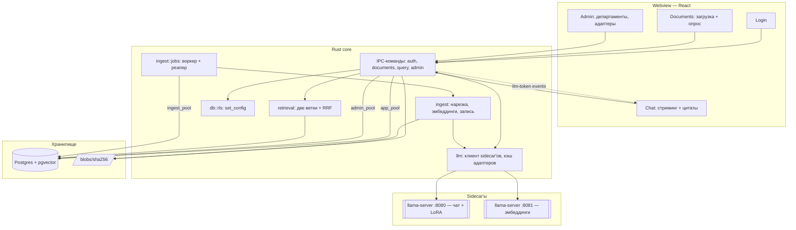
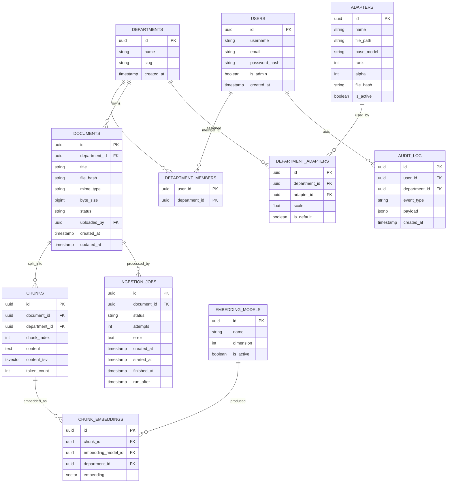

# Enclave — Design Document

2026-09-23 · @Vladee101

Корпоративный AI-ассистент, который целиком работает внутри контура: RAG по документам организации, ответ голосом департамента через LoRA-адаптеры, изоляция департаментов средствами PostgreSQL. Десктопное приложение на Tauri 2 + Rust. Портфолио-проект для позиционирования System Analyst / Solutions Architect.

## Обзор

Enclave отвечает на вопросы сотрудника по документам его департамента. Документы, эмбеддинги, языковая модель и каждый запрос остаются на машине пользователя или в его локальной сети — штатный путь исполнения не делает ни одного сетевого вызова наружу (ADR-0002). Ответ собирается из найденных фрагментов (гибридный поиск, ADR-0006) и формируется базовой моделью с LoRA-адаптерами департаментов спрашивающего (ADR-0004). Сотрудник одного департамента не может получить документы другого: это обеспечивает Row-Level Security в базе, а не проверки в коде приложения (ADR-0008).

Цель проекта — показать компетенцию в проектировании систем, где главное нефункциональное требование — граница данных: суверенитет (ничего не уходит наружу) и изоляция (ничего не переходит между департаментами). Обе границы должны держаться на механизме, который можно проверить тестом, а не на аккуратности разработчика.

Документ описывает целевой дизайн и честно фиксирует, где код от него отстаёт. Сводка расхождений — в разделе «Известные расхождения кода и дизайна»; на момент написания инференс ни разу не выполнялся на настоящей модели.

## Функциональные требования

| ID | Требование | Статус |
| --- | --- | --- |
| FR1 | Локальный профиль: создание с PIN (хэш argon2), вход выбором профиля и вводом PIN | готово |
| FR2 | Первый профиль, созданный при отсутствии администратора, получает права администратора (bootstrap) | готово |
| FR3 | Новый профиль получает личный департамент и членство в нём | готово |
| FR4 | Администратор создаёт департаменты | готово |
| FR5 | Администратор управляет членством: добавить / убрать пользователя в департаменте | готово |
| FR6 | Загрузка документа в один из своих департаментов: sha-256 → блоб → строка `documents` → задача в `ingestion_jobs`; управление возвращается сразу (ADR-0010) | готово |
| FR7 | Фоновый приём: извлечение текста → нарезка → эмбеддинги → запись `chunks` + `chunk_embeddings`; `documents.status` `pending` → `ready` / `failed` | готово для `.txt` / `.md` |
| FR8 | Опрос статуса задачи приёма из интерфейса | готово |
| FR9 | Список документов своих департаментов | готово |
| FR10 | Вопрос → гибридный поиск по документам своих департаментов → ответ с нумерованными цитатами (`sources`) | код есть, вживую не проверен |
| FR11 | Стриминг ответа по токенам | код есть, вживую не проверен |
| FR12 | К генерации применяются LoRA-адаптеры всех департаментов пользователя с их `scale` | код есть, вживую не проверен |
| FR13 | Администратор регистрирует файл адаптера и назначает его департаменту со `scale` | готово; адаптер начинает работать после перезапуска sidecar |
| FR14 | Журнал аудита: вход (в т. ч. неудачный), выход, создание профиля, административные действия, загрузка, запрос | готово |
| FR15 | Повторная загрузка того же файла в тот же департамент не создаёт дубль; повторная загрузка упавшего документа ставит его в очередь заново | готово |

## Нефункциональные требования

| ID | Требование | Порог |
| --- | --- | --- |
| NFR1 | Суверенитет данных | 0 исходящих соединений за пределы `127.0.0.1` / LAN в штатном пути (вход, загрузка, приём, вопрос). Разовые загрузки при установке (`fetch-sidecar.ps1`, веса) — вне штатного пути (ADR-0002) |
| NFR2 | Изоляция департаментов | 0 строк чужого департамента в любой выборке под `app_user` — в документах, фрагментах, векторах, адаптерах, задачах. Политики закрыты по умолчанию: без `app.current_user_id` — ноль строк. Проверка — `rls_validation`, падение теста блокирует релиз (ADR-0008) |
| NFR3 | Минимальные привилегии | Путь запросов — роль без `SUPERUSER` и `BYPASSRLS`; `BYPASSRLS` есть только у `ingest_worker`, и только воркер им пользуется; у `ingest_worker` нет DDL, `CREATEDB`, `CREATEROLE` |
| NFR4 | Задержка ответа | На эталонном железе (RTX 4050 Laptop 6 GB, Qwen 2.5 3B Q4_K_M): до первого токена ≤ 2 сек (p95), полный ответ ≤ 30 сек при `n_predict = 768`. *Замер 2026-09-23 (3 вопроса, не p95): до первого токена 0.2–0.7 сек, полный ответ 0.5–1.1 сек* |
| NFR5 | Отзывчивость загрузки | `upload_document` возвращает управление ≤ 1 сек для файла ≤ 10 МБ; тяжёлая работа — только в воркере |
| NFR6 | Пропускная способность приёма | Текстовый файл 1 МБ индексируется ≤ 2 мин на эталонном железе. *Замер: 63 и 95 фрагментов за 2.3 и 1.6 сек (≈ 30–60 фрагм./сек) — 1 МБ ≈ 40–80 сек* |
| NFR7 | Плавная деградация | Без sidecar приложение стартует; вход, загрузка и список документов работают; приём завершается `failed` с внятной причиной; вопрос возвращает ошибку, а не зависает |
| NFR8 | Устойчивость приёма | Падение процесса не оставляет задач в `running` навсегда (реапер при старте) и не оставляет документа с частью фрагментов (одна транзакция на документ) |
| NFR9 | Пул соединений не блокируется моделью | Ни одна транзакция БД не открыта во время HTTP-вызова к модели или эмбеддеру (инвариант №4 CLAUDE.md). Приём сначала считает все эмбеддинги, затем пишет одной короткой транзакцией |
| NFR10 | Проверяемость ответа | 100% ответов возвращаются со списком `sources`; каждая цитата указывает на документ, видимый спрашивающему |
| NFR11 | Воспроизводимость схемы | Чистая база, собранная только миграциями, совпадает с тем, что ожидает код. Проверка — `rls_validation` на одноразовой базе |
| NFR12 | Аппаратный минимум | 16 ГБ RAM, GPU 6 ГБ VRAM (CUDA). Замер: 3B Q4_K_M + nomic-embed-text с контекстом 8 192 / 2 048 занимают 2.6 ГБ VRAM вместе; 7B Q4 поместится с частичной выгрузкой. Без GPU — работоспособно, но NFR4 не выполняется |

**Бюджет задержки вопроса (NFR4)**

Порог — сумма шагов; без разбивки его нельзя ни спроектировать, ни проверить. Бюджет писался под 7B до первого запуска; колонка «Замер» — Qwen 2.5 3B, 2026-09-23, три вопроса по двум документам (не p95 и не нагрузка — ориентир, а не приёмка).

| Шаг | Бюджет (p95) | Примечание |
| --- | --- | --- |
| Эмбеддинг вопроса | ≤ 0.05 сек | отдельный sidecar на 8081, до открытия транзакции (инвариант №4). Замер: 30–70 мс |
| `BEGIN` + `set_config` | ≤ 0.01 сек | |
| Плотная ветка (HNSW, `2 × top_k`) | ≤ 0.05 сек | RLS фильтрует после индекса — см. «Поиск и ранжирование» |
| Лексическая ветка (GIN, `2 × top_k`) | ≤ 0.05 сек | |
| RRF + разрешение адаптеров | ≤ 0.01 сек | в памяти, кэш path → id |
| Prefill промпта (~1 000 токенов: 5 фрагментов по 512 символов + инструкция) | ≤ 1.5 сек | Замер: 650–825 токенов за 0.19–0.59 сек. Подмена LoRA не измерена — адаптеров ещё нет |
| **До первого токена** | **≤ 1.7 сек** | запас 0.3 сек до NFR4 |
| Генерация до 768 токенов | ≤ 28 сек | Замер: 67–76 ток/с на 3B целиком в VRAM; ответы 16–29 токенов |

**Пропускная способность приёма (NFR6).** Фрагмент — 512 символов с перекрытием 64, то есть шаг 448: файл 1 МБ текста даёт ~2 300 фрагментов. Эмбеддинг сейчас идёт по одному фрагменту за вызов: при ~20–40 мс на вызов это 45–90 сек. Порог 2 мин оставляет запас, но только для одного документа за раз: воркер однопоточный. Батчинг эмбеддингов (`/embeddings` принимает массив) — первый рычаг, если порог не выполнится.

**Параллелизм.** Приложение однопользовательское на машину: одновременно работает один человек, конкуренция — между его вопросом и фоновым приёмом за GPU. Оба sidecar'а делят одну видеокарту; пока идёт приём большого документа, задержка вопроса вырастет. Это осознанное ограничение v1, многопользовательский режим по LAN — v2.

## Критерии приёмки

**UC1 — первый запуск и bootstrap администратора**

- Given в базе нет ни одного администратора, When создаётся профиль, Then он получает `is_admin = true`, личный департамент и членство в нём — одной транзакцией
- Given администратор уже есть, When создаётся ещё один профиль, Then `is_admin = false`
- Given администратор есть, но создан до миграции 005 (флаг добавлен на уже заполненную таблицу), When создаётся профиль, Then правило «нет ни одного администратора» всё равно срабатывает — проверка по `is_admin`, а не по пустоте таблицы

**UC2 — вход по PIN**

- Given профиль существует, When введён верный PIN, Then возвращается `ok = true` с `user_id`, `username`, `is_admin`
- Given неверный PIN или несуществующий профиль, When выполняется вход, Then ответ одинаковый (`ok = false`) — по ответу нельзя отличить «нет такого» от «не тот PIN»

**UC3 — создание департамента**

- Given пользователь без прав администратора, When вызывается `cmd_create_department`, Then ошибка «Admin privileges required», строка не создаётся
- Given администратор, When создаёт департамент, Then у департамента уникальный `slug`, и он не виден ни одному пользователю, пока в нём нет членов (RLS на `departments`)

**UC4 — управление членством**

- Given администратор добавляет пользователя в департамент, When пользователь выполняет следующий запрос, Then документы этого департамента видны ему без перезапуска и без повторного входа — членство проверяется политикой на каждом запросе
- Given пользователь удалён из департамента, When он задаёт вопрос, Then ни один фрагмент этого департамента не попадает в `sources`, даже если ответ на похожий вопрос раньше их цитировал

**UC5 — регистрация LoRA-адаптера**

- Given администратор указывает путь к `.gguf` и `scale` ∈ [0; 2], When адаптер назначается департаменту, Then в каталоге `adapters` одна строка на файл (ключ — sha-256 содержимого), а назначение того же файла второму департаменту переиспользует её
- Given адаптер назначен, но sidecar запущен до назначения, When пользователь департамента задаёт вопрос, Then адаптер пропускается с предупреждением в логе, а не подставляется чужим id (инвариант №5)

**UC6 — загрузка документа**

- Given пользователь — член департамента, When загружает файл, Then блоб записан в `{app_data}/blobs/{sha256}` **до** вставки строки, документ в статусе `pending`, задача в `queued`, управление вернулось ≤ 1 сек (NFR5)
- Given пользователь не член целевого департамента, When пытается загрузить в него файл, Then вставка отклоняется политикой `documents_dept_insert`, задача не создаётся
- Given тот же файл уже загружен в этот департамент, When он загружается повторно, Then пользователь получает существующий документ и его последнюю задачу, а не ошибку уникальности; если документ в `failed` — создаётся новая задача, документ снова `pending`

**UC7 — фоновый приём (система)**

- Given задача в `queued` и её `run_after` наступил, When воркер свободен, Then он забирает её через `FOR UPDATE SKIP LOCKED`, увеличивает `attempts` и переводит в `running`
- Given вызов эмбеддера упал по HTTP (таймаут, отказ соединения, 5xx) и `attempts` < 3, When воркер обрабатывает ошибку, Then задача возвращается в `queued` с `run_after` через 30 / 60 сек, документ остаётся `pending`; прочие ошибки и третья неудача — сразу `failed`
- Given sidecar эмбеддингов недоступен, When воркер берёт задачу, Then задача `failed` с текстом «sidecar unavailable», документ не остаётся в `pending` навсегда
- Given процесс упал во время приёма, When приложение стартует снова, Then задачи в `running` возвращаются в `queued`, а фрагментов упавшего документа в базе нет (одна транзакция)
- Given эмбеддер вернул вектор не той размерности, When воркер пишет фрагменты, Then приём падает с «Embedding dimension mismatch», ни один фрагмент не сохранён (инвариант №6)
- Given приём завершён, When проверяются `chunks` и `chunk_embeddings`, Then у каждой строки `department_id` равен `department_id` родительского документа (ADR-0009)

**UC8 — статус приёма**

- Given пользователь загрузил документ, When интерфейс опрашивает задачу, Then статус меняется на `succeeded` / `failed` в течение одного интервала опроса после завершения
- Given пользователь открывает список документов после перезапуска, When у документа `failed`, Then бейдж показывает `failed`, а не `pending`

**UC9 — вопрос по документам**

- Given у пользователя есть готовые документы, When он задаёт вопрос, Then ответ сопровождается нумерованными `sources`, и каждая цитата — из департамента, где он член (NFR2, NFR10)
- Given у двух департаментов есть документы на одну тему, When вопрос задаёт член только одного из них, Then ни одна цитата и ни один фрагмент контекста промпта не относятся к другому департаменту
- Given `app.current_user_id` не выставлен (ошибка в коде вызова), When выполняется поиск, Then результат пуст, а не «все документы» — закрыто по умолчанию
- Given релевантных фрагментов нет, When модель отвечает, Then ответ говорит, что в документах этого нет, а не выдумывает *(держится только на инструкции в промпте — см. «Поиск и ранжирование»)*
- Given пользователь состоит в департаменте с LoRA-адаптером, When он задаёт вопрос, Then запрос к `/completion` содержит `lora: [{id, scale}]` с id, выданным sidecar'ом

**UC10 — журнал аудита**

- Given пользователь вошёл, загрузил документ и задал вопрос, When открывается его журнал, Then видны три события с временем, департаментом и идентификаторами документов / фрагментов; текста вопроса в журнале нет
- Given действие не удалось и транзакция откатилась, When открывается журнал, Then записи об этом действии нет — запись пишется в той же транзакции, что и действие
- Given пользователь пытается записать событие от имени другого, When выполняется вставка под `app_user`, Then её отклоняет политика `audit_log_own_insert`
- Given пользователь смотрит журнал, When в нём есть события других пользователей, Then они не видны (политика `audit_log_own_select`)

## Use cases

| ID | Актор | Сценарий |
| --- | --- | --- |
| UC1 | Первый пользователь | Создаёт первый профиль и становится администратором |
| UC2 | Сотрудник | Входит по PIN |
| UC3 | Администратор | Создаёт департамент |
| UC4 | Администратор | Управляет членством в департаментах |
| UC5 | Администратор | Регистрирует LoRA-адаптер и назначает его департаменту |
| UC6 | Сотрудник | Загружает документ в свой департамент |
| UC7 | Воркер приёма | Извлекает, режет, эмбеддит и сохраняет документ |
| UC8 | Сотрудник | Отслеживает статус приёма |
| UC9 | Сотрудник | Задаёт вопрос и получает ответ с цитатами |
| UC10 | Сотрудник / Администратор | Просматривает журнал аудита |

**Детализация ключевых use cases (формат: Actor / Precondition / Main flow / Alternative flow / Postcondition):**

**UC6: Сотрудник загружает документ**

- Actor: Сотрудник
- Precondition: пользователь вошёл (UC2) и состоит хотя бы в одном департаменте
- Main flow:
  1. Пользователь выбирает департамент из списка *своих* департаментов (`cmd_list_my_departments`, RLS) и файл
  2. Ядро считает sha-256 и пишет байты в `{app_data}/blobs/{sha256}`
  3. В одной транзакции под `app_user` с выставленным `app.current_user_id`: строка `documents` (`pending`) и строка `ingestion_jobs` (`queued`)
  4. Интерфейс получает `job_id` и начинает опрос (UC8)
- Alternative flow: пользователь не член департамента → политика отклоняет вставку, блоб остаётся на диске как сирота (не опасен: без строки `documents` его никто не прочтёт; чистка сирот — технический долг)
- Postcondition: документ в очереди на приём; байты на диске раньше, чем строка в базе

**UC7: Воркер принимает документ**

- Actor: Воркер приёма (роль `ingest_worker`, BYPASSRLS)
- Precondition: задача в `queued`
- Main flow:
  1. Claim задачи `FOR UPDATE SKIP LOCKED`, `attempts + 1`, `running`
  2. Чтение строки документа и блоба по `file_hash`
  3. Извлечение текста (сейчас — lossy UTF-8 для любого MIME), нарезка 512 / 64 символов
  4. Для каждого фрагмента — эмбеддинг на sidecar 8081
  5. Запись `chunks` и `chunk_embeddings` с `department_id` родительского документа, `documents.status = ready`, `ingestion_jobs.status = succeeded`
- Alternative flow: sidecar недоступен, блоб не найден, нет активной модели эмбеддингов, размерность не совпала → `failed` с текстом ошибки у задачи и документа
- Postcondition: документ участвует в поиске ИЛИ помечен `failed` с причиной
- Note: воркер обходит RLS, поэтому корректность `department_id` на фрагментах — его личная ответственность (ADR-0009, будущий ADR-0012). Это единственное место в системе, где изоляция держится на коде, а не на политике

**UC9: Сотрудник задаёт вопрос**

- Actor: Сотрудник
- Precondition: пользователь вошёл; sidecar'ы чата и эмбеддингов работают
- Main flow:
  1. Эмбеддинг вопроса — вне транзакции
  2. `BEGIN`; `set_config('app.current_user_id', …, true)`
  3. Плотная и лексическая ветки поиска, по `2 × top_k` кандидатов каждая; RLS отсекает чужие департаменты
  4. Слияние RRF, `top_k = 5`
  5. Разрешение адаптеров департаментов пользователя в id sidecar'а
  6. `COMMIT` — до вызова модели
  7. Промпт «отвечай только по контексту», `/completion` со `stream: true` и `lora`, токены уходят событием `llm-token:<request_id>`
  8. Возврат полного ответа и `sources` (документ, фрагмент 200 символов, RRF-оценка)
- Alternative flow: sidecar недоступен → ошибка в интерфейсе; ни одного подходящего фрагмента → модель получает пустой контекст и по инструкции отвечает, что информации нет
- Postcondition: пользователь видит ответ и нумерованные источники

---

**User stories:**

- Как сотрудник, я хочу задать вопрос своими словами и получить ответ со ссылками на документы, чтобы не искать нужный регламент вручную и сразу проверить источник.
- Как сотрудник юридического отдела, я хочу, чтобы ответ звучал так, как принято у нас, а не как у маркетинга, — поэтому адаптер зависит от департамента.
- Как руководитель департамента, я хочу быть уверен, что содержимое наших документов не попадёт в ответы другим отделам, даже если кто-то ошибётся в коде.
- Как офицер по безопасности, я хочу проверить, что данные не покидают машину, по сетевой активности процесса, а не по обещанию вендора.
- Как администратор, я хочу назначать адаптеры и членство без разработчика.

## Use case diagram



Администратор — тот же сотрудник с флагом `is_admin`, а не отдельный тип учётной записи: у него есть свой департамент, он загружает документы и задаёт вопросы на общих основаниях, и RLS на его запросы действует так же. Отдельны только административные команды. UC7 включается в UC6 асинхронно: загрузка завершается, не дожидаясь приёма (ADR-0010).

## Sequence diagram — вопрос (UC9)



Транзакция закрывается до вызова модели: генерация длится десятки секунд, а пул — десять соединений (инвариант №4). Личность пользователя живёт ровно одну транзакцию — `set_config(…, true)` откатывается на `COMMIT`, поэтому следующий запрос на том же соединении её не унаследует.

## Sequence diagram — загрузка и приём (UC6 / UC7)

```mermaid
sequenceDiagram
  participant UI as React
  participant Core as Rust core (app_user)
  participant FS as blobs/{sha256}
  participant DB as Postgres
  participant W as Воркер (ingest_worker)
  participant Emb as llama-server :8081

  UI->>Core: cmd_upload_document(department_id, bytes)
  Core->>Core: sha-256
  Core->>FS: write (до вставки в БД)
  Core->>DB: BEGIN; set_config; INSERT documents (pending); INSERT ingestion_jobs (queued); INSERT audit_log; COMMIT
  Core-->>UI: {job_id, status: queued}
  loop каждые 1.5 сек
    UI->>Core: cmd_get_job_status(job_id)
  end
  W->>DB: UPDATE … FOR UPDATE SKIP LOCKED → running, attempts+1
  W->>FS: read blob
  W->>W: извлечение, нарезка 512/64
  loop на каждый фрагмент (транзакция не открыта)
    W->>Emb: POST /embeddings
  end
  W->>DB: BEGIN; INSERT chunks, chunk_embeddings (department_id родителя); documents.status = ready; COMMIT
  W->>DB: job = succeeded
```

Эмбеддинги считаются до открытия транзакции и держатся в памяти (~7 МБ векторов на текстовый файл 1 МБ), затем всё пишется одной короткой транзакцией — инвариант №4 соблюдён, а документ по-прежнему записывается целиком или никак.

## Диаграмма состояний документа и задачи



Состояние склеено из двух полей: `documents.status` (`pending` / `ready` / `failed`) и `ingestion_jobs.status` (`queued` / `running` / `succeeded` / `failed`); `Pending` на диаграмме — документ `pending` с задачей `queued`. Временные сбои эмбеддера повторяются автоматически: до трёх попыток с паузой 30 и 60 сек (`run_after`, миграция 008). Постоянные ошибки не повторяются — на второй попытке они упадут так же; для них путь назад — повторная загрузка того же файла (FR15). Один переход по-прежнему отсутствует: смена модели эмбеддингов не переиндексирует готовые документы, а поиск видит только векторы активной модели — непереиндексированные документы выпадают из плотной ветки (см. «Поиск и ранжирование»).

## Матрица доступа

Аналог decision table для этого проекта: какие роли и через какой механизм видят какие данные. Порядок проверок — часть спецификации: сначала роль подключения (есть ли `BYPASSRLS`), затем политика таблицы, затем членство.

**Роли подключения**

| Роль | Атрибуты | Кто пользуется | Пул |
| --- | --- | --- | --- |
| `app_user` (через логин-роль `enclave_app`) | NOLOGIN, без SUPERUSER, без BYPASSRLS | все пользовательские команды | `app_pool` |
| `ingest_worker` | LOGIN, BYPASSRLS, без SUPERUSER / CREATEDB / CREATEROLE | только воркер приёма | `ingest_pool` |
| `postgres` | SUPERUSER | миграции, bootstrap, вход, административные команды | `admin_pool` |

**Политики под `app_user`** (все таблицы — `ENABLE` + `FORCE ROW LEVEL SECURITY`)

| Таблица | SELECT | INSERT | UPDATE | DELETE |
| --- | --- | --- | --- | --- |
| `departments` | член (`is_member_of(id)`) | — | — | — |
| `department_members` | свои строки | — | — | — |
| `documents` | член | член (WITH CHECK) | член | член |
| `chunks` | член | член | член | член |
| `chunk_embeddings` | член | член | член | член |
| `department_adapters` | член | член | член | член |
| `ingestion_jobs` | член департамента документа | то же | то же | — |
| `audit_log` | свои строки | свои строки | — | — |
| `users`, `embedding_models`, `adapters` | без RLS | | | |

«—» — политики нет, при `FORCE` это означает отказ. `is_member_of()` — `SECURITY DEFINER`, чтобы читать `department_members` в обход её собственной политики; `current_user_id()` — plpgsql, возвращает `NULL` на пустой или битой переменной вместо исключения, поэтому политика закрывается, а не падает.

**Инварианты, проверяемые тестами:**

1. Без `app.current_user_id` любая выборка из таблицы с политикой возвращает ноль строк.
2. Пользователь видит документы, фрагменты, векторы и адаптеры только своих департаментов — проверяется на каждой таблице отдельно, а не только на `documents`.
3. Вставка документа в чужой департамент отклоняется политикой, а не кодом команды.
4. Запросы поиска не содержат условия по `department_id`, и изоляция всё равно держится: тест обязан падать, если политику снять (инвариант №7 — фильтр в SQL не граница безопасности).
5. `department_id` каждого фрагмента и вектора равен `department_id` документа (контроль за BYPASSRLS-воркером).
6. Личность не протекает между транзакциями на одном соединении пула.

Сейчас `rls_validation` покрывает инварианты 2 и 3 и частично 1 (чужой `user_id` → ноль строк; задача приёма без `set_config` не видна). Инварианты 4–6 в тестах не выражены.

**Административный путь.** `cmd_create_department`, `cmd_add_adapter`, `cmd_list_departments`, `cmd_list_adapters` работают через `admin_pool`, то есть под суперпользователем: RLS для них не существует, и единственная проверка — `require_admin()` в коде. Это осознанная асимметрия: провижининг по определению вне досягаемости политик (CLAUDE.md, задача 6). Цена — суперпользователь в рантайме приложения; замена на отдельную роль провижининга без SUPERUSER — в roadmap.

## Поиск и ранжирование

Роль раздела «Confidence и пороги» из других проектов: какие числа управляют выдачей и откуда они взялись.

| Параметр | Значение | Происхождение |
| --- | --- | --- |
| Размер фрагмента | 512 символов | стартовое значение, не калибровалось |
| Перекрытие | 64 символа | стартовое значение |
| `top_k` | 5 | по умолчанию в `QueryArgs` |
| Кандидатов на ветку | `2 × top_k` = 10 | CLAUDE.md |
| RRF `k` | 60 | исходная статья Cormack et al., ADR-0006 |
| HNSW `m` / `ef_construction` | 16 / 64 | умолчания pgvector |
| `ef_search` | 40 | умолчание pgvector, в коде не выставляется |
| Размерность | 768 | `vector(768)`, ADR-0007 |
| Конфигурация FTS | `english`, запрос — ИЛИ по основам слов вопроса | миграция 002; ИЛИ — после замера (ниже) |
| Шаблон промпта | чат-шаблон из GGUF модели (`/apply-template`) | после замера (ниже) |
| `temperature` / `n_predict` | 0.3 / 768 | `commands/query.rs` |

**Что показал первый запуск на живой модели.** Две находки изменили код. *Лексическая ветка была мертва:* `plainto_tsquery` соединяет все слова вопроса через И, и вопрос обычным языком («which port does the signaling server run on…») не совпадал ни с одним фрагментом — гибридный поиск фактически был чисто векторным. Теперь запрос — ИЛИ по основам слов, и `ts_rank_cd` поднимает фрагменты, где слов больше; на тех же вопросах ветка дала 10 и 6 кандидатов вместо нуля. *Промпт шёл без чат-шаблона:* instruct-модель, получив сырой текст, не знала, где кончается её реплика, — давала верный ответ и затем повторяла его до лимита в 768 токенов (10 сек вместо секунды). Теперь промпт оборачивается шаблоном, записанным в самой модели (`/apply-template` llama-server), — без кода под конкретную модель; инструкции идут в системную реплику, фрагменты — в пользовательскую, как цитируемые данные.

**Порога релевантности нет.** В отличие от маршрутизации в SupportA, здесь нет `rag_confidence` и нет ветки «ничего не нашли — не отвечаю»: RRF-оценка ранговая и не говорит, насколько фрагмент близок к вопросу, — у фрагмента, найденного одной веткой на первом месте, оценка 1/61 независимо от того, релевантен ли он вообще. От выдумки защищает только инструкция в промпте. Если замер (см. «Методика оценки») покажет выдумки на вопросах вне корпуса, нужен отдельный сигнал — максимум косинусной близости по плотной ветке, как в SupportA, с калиброванным порогом.

**HNSW и RLS.** Индекс ищет ближайших соседей по всем департаментам, затем RLS отбрасывает чужие строки. HNSW при `ef_search = 40` отдаёт не больше ~40 кандидатов; если большинство из них принадлежат чужим департаментам, после фильтра останется меньше `2 × top_k`, вплоть до нуля — при том что в своём департаменте подходящие фрагменты есть. Это проблема полноты, не безопасности: чужое не утекает, своё теряется. Для маленького департамента в большой базе она станет заметной первой. Варианты: явное условие `department_id = ANY(...)` для скоупа (инвариант №7 это прямо разрешает), итеративный скан pgvector 0.8 (`hnsw.iterative_scan`), частичные индексы на департамент. Выбор — после замера.

**Смешение моделей.** Плотная ветка берёт только векторы активной модели (строка `embedding_models` с `is_active`): косинус между векторами разных моделей бессмыслен, а ADR-0007 оставляет старые строки жить на время переиндексации. Обратная сторона — после смены модели непереиндексированные документы находятся только лексической веткой. Переиндексация при смене модели — v1.1.

**Русский язык.** Лексическая ветка использует конфигурацию `english`: русские словоформы не приводятся к основе, и «договора» не найдёт «договор». Для русскоязычных документов нужна конфигурация `russian` или колонка конфигурации на документ — это миграция с пересчётом `content_tsv`.

## Методика оценки (Evaluation)

Изоляцию можно доказать тестом, качество ответа — только измерением. Ни одной метрики ниже сейчас не замерено: для этого нужна работающая модель.

**Эталонный корпус.** Два-три синтетических департамента (например, HR и инженерия) по 20–50 документов, с намеренно пересекающимися темами — отпуск, командировки, доступы — чтобы вопрос одного департамента имел правдоподобный ответ в документах другого. На корпусе — 100–150 вопросов с разметкой «ожидаемый документ» и 30 вопросов, ответа на которые в корпусе нет.

**Метрики и пороги приёмки.**

| Метрика | Цель | Зачем именно она |
| --- | --- | --- |
| Утечка между департаментами в `sources` и в контексте промпта | 0 | NFR2 на уровне ответа, а не строки: проверяется весь путь, включая сборку промпта |
| Recall@5 гибридного поиска | ≥ 0.85 | качество поиска отдельно от генерации; заодно показывает, помогает ли лексическая ветка |
| Recall@5 для департамента с < 5% фрагментов базы | ≥ 0.85 | прямая проверка проблемы «HNSW и RLS» |
| Groundedness ответов (ручная разметка 50 шт.) | ≥ 0.9 | ответ опирается на процитированные фрагменты |
| Отказ на вопросах вне корпуса | ≥ 0.9 | нет порога релевантности — проверяем, держит ли инструкция |
| Корректность цитат: номер `[Source N]` в ответе совпадает с фрагментом, откуда взят факт | ≥ 0.9 | цитата, указывающая не туда, хуже отсутствия цитаты |
| Эффект LoRA: слепое попарное сравнение с адаптером и без | предпочтение ≥ 60% в пользу адаптера | ADR-0004 утверждает, что адаптер меняет голос; без замера это не доказано |
| До первого токена / полный ответ | NFR4 | на эталонном железе |

**Регресс.** Скрипт оценки запускается при изменении промпта, параметров нарезки и поиска, модели или адаптеров. Результат — таблица «метрика / порог / замер / дельта» в репозитории, как в SupportA.

## Архитектура и стек

Оболочка — Tauri 2, интерфейс — React + Vite + TypeScript, ядро — Rust (tokio, sqlx 0.8, reqwest). Хранилище — PostgreSQL 16 + pgvector: реляционные данные, векторы и полнотекстовый индекс в одной базе (ADR-0005). Инференс — два процесса `llama-server` из llama.cpp как sidecar'ы Tauri (ADR-0003): чат-модель с LoRA и отдельная модель эмбеддингов.



Интерфейс общается с ядром только через IPC-команды Tauri; HTTP-сервера у приложения нет. Ядро общается с моделями по HTTP на `127.0.0.1`, с базой — по TCP на localhost.

## Component diagram



Три пула — три роли, а не три копии одной строки подключения (инвариант №8): `app_pool` для всего пользовательского, `ingest_pool` только для воркера, `admin_pool` для миграций, входа и провижининга. Воркер — единственный компонент без пользовательской сессии и единственный, у кого есть `BYPASSRLS`; поэтому он и единственный, кто сам отвечает за `department_id`. Sidecar эмбеддингов необязателен при старте: без него работают вход, список документов и административные функции (NFR7).

## Схема данных (ERD)

Источник истины — `enclave/migrations/001–008`. `db/schema.sql` — исходный референсный проект, нигде не применяется и с живой схемой расходится.



| Таблица | Назначение |
| --- | --- |
| users | Локальные профили. `password_hash` — argon2 от PIN; `email` — синтетический `username@local`, нужен только ради UNIQUE; `is_admin` — единственный механизм ролей |
| departments | Департаменты. Видны пользователю, только если он в них член (миграция 005) |
| department_members | Членство — то, на чём стоит вся изоляция: `is_member_of()` читает именно эту таблицу |
| documents | Документ без пути к файлу: байты адресуются `file_hash` в блоб-хранилище. UNIQUE `(department_id, file_hash)` — один и тот же файл в двух департаментах — два документа, и это правильно: права у них разные |
| chunks | Фрагменты с денормализованным `department_id` (ADR-0009) и генерируемой `content_tsv` для лексической ветки |
| chunk_embeddings | Векторы с ключом `(chunk_id, embedding_model_id)`: переиндексация новой моделью добавляет строки, а не затирает (ADR-0007). `department_id` денормализован, чтобы политика и фильтр жили на индексируемой таблице |
| embedding_models | Реестр моделей; ровно одна `is_active` — её выбирает воркер. Sidecar эмбеддингов регистрирует себя при старте |
| adapters | Каталог файлов LoRA, одна строка на файл (UNIQUE `file_hash`). Без RLS: файл адаптера сам по себе не принадлежит департаменту |
| department_adapters | Назначение адаптера департаменту со `scale` ∈ [0; 2]; не больше одного `is_default` на департамент |
| ingestion_jobs | Очередь приёма (ADR-0010): статус, попытки, текст ошибки, `run_after` — не раньше какого момента брать задачу (backoff повторов) |
| audit_log | Журнал событий (FR14): пишется в той же транзакции, что и действие (`audit.rs`). В `payload` — идентификаторы (документы, фрагменты, департаменты), не содержимое: текст вопросов и фрагментов в журнал не попадает |

**Индексы**

| Индекс | Назначение |
| --- | --- |
| HNSW `chunk_embeddings (embedding vector_cosine_ops)`, m = 16, ef_construction = 64 | плотная ветка |
| GIN `chunks (content_tsv)` | лексическая ветка |
| B-tree `department_id` на `chunks`, `chunk_embeddings`, `documents` | вычисление политик и скоуп поиска |
| partial `ingestion_jobs (status) WHERE status IN ('queued','running')` | claim воркером без скана истории |
| `ingestion_jobs (document_id)` | статус документа, политика задач |
| partial `ingestion_jobs (run_after) WHERE status = 'queued'` | claim с учётом backoff (миграция 008) |
| `audit_log (created_at DESC)`, `audit_log (user_id)` | журнал |
| unique `documents (department_id, file_hash)` | дедупликация в пределах департамента |
| unique `department_adapters (department_id) WHERE is_default` | один адаптер по умолчанию |

**Спящие объекты.** В dev-базе, которая когда-то была создана вручную из `db/schema.sql`, остались таблицы `memberships` / `roles` / `conversations` / `query_logs` и семь разрешающих политик на функции `app_user_in_department()`. Таблица `memberships` пуста, поэтому активного обхода нет, но разрешающие политики в Postgres складываются через OR — одна случайная строка расширит доступ на семь таблиц. Чистка отложена и расписана в ADR-0011. Чистая база из миграций этих объектов не содержит.

## API-контракты

Публичного HTTP API у приложения нет. Контракты — IPC-команды Tauri (интерфейс → ядро) и HTTP sidecar'ов (ядро → модели, только localhost).

**Аутентификация и профили**

| Команда | Пул / роль | Контекст RLS | Назначение |
| --- | --- | --- | --- |
| `cmd_list_users` | admin | — | Список профилей для экрана входа: `id`, `username`, `is_admin` |
| `cmd_create_user {username, pin}` | admin | — | Профиль + личный департамент + членство; bootstrap администратора (UC1) |
| `cmd_login {user_id, pin}` | admin | — | Проверка PIN → `{ok, user_id, username, is_admin}`; при успехе — сессия в ядре, при неудаче — сброс сессии и запись `login_failed` |
| `cmd_logout` | admin | — | Запись `logout` в журнал, очистка сессии ядра |
| `cmd_current_session` | — | — | Кто вошёл, по мнению ядра, или `null`; интерфейс восстанавливает состояние отсюда |

**Документы**

| Команда | Пул / роль | Контекст RLS | Назначение |
| --- | --- | --- | --- |
| `cmd_upload_document {department_id, filename, mime_type?, file_contents}` | app | да | UC6 → `JobStatus {job_id, document_id, status}`. Повторная загрузка — существующий документ и его последняя задача (FR15) |
| `cmd_list_documents` | app | да | Документы своих департаментов |
| `cmd_list_my_departments` | app | да | Свои департаменты — для выбора при загрузке |
| `cmd_get_job_status {job_id}` | app | да | Статус задачи → `JobStatus \| null`; чужая задача — `null` |

**Вопрос**

| Команда | Пул / роль | Контекст RLS | Назначение |
| --- | --- | --- | --- |
| `cmd_query {query, top_k?}` | app | да | UC9 без стриминга → `{answer, sources[]}` |
| `cmd_query_stream {request_id, args: {query, top_k?}}` | app | да | UC9 со стримингом: токены в событии `llm-token:<request_id>` как `{token}`, итог — `{answer, sources[]}` |

`sources[]` — `{document_id, filename, excerpt (200 символов), score (RRF)}`.

**Администрирование** (все — `require_admin` по сессии с перепроверкой `users.is_admin` в базе, затем `admin_pool`; изменения пишутся в журнал в той же транзакции)

| Команда | Назначение |
| --- | --- |
| `cmd_list_departments` | Все департаменты организации |
| `cmd_create_department {name}` | UC3 |
| `cmd_list_adapters` | Все назначения адаптеров |
| `cmd_add_adapter {department_id, adapter_path, scale}` | UC5: upsert в `adapters` по sha-256 файла + upsert назначения |
| `cmd_list_memberships` | Все членства: пользователь × департамент |
| `cmd_add_member {user_id, department_id}` | UC4, идемпотентно (`ON CONFLICT DO NOTHING`) |
| `cmd_remove_member {user_id, department_id}` | UC4, действует со следующей транзакции участника |
| `cmd_list_audit {limit?}` | UC10. Не только для администратора: администратор видит весь журнал, остальные — свои записи через RLS (`audit_log_own_select`) |

**Sidecar'ы (llama-server, localhost)**

| Порт | Метод | Путь | Назначение |
| --- | --- | --- | --- |
| 8080 / 8081 | GET | /health | ожидание готовности при старте (до 60 с / 30 с). Веса — абсолютный путь из `ENCLAVE_MODELS_DIR` или `{app_data}/models`, наличие файла проверяется до запуска |
| 8080 | GET | /lora-adapters | `[{id, path}]` → кэш path → id (инвариант №5) |
| 8080 | POST | /completion | `{prompt, n_predict, temperature, lora:[{id, scale}], stream}`; при `stream` — SSE-кадры `data: {content, stop}` |
| 8081 | POST | /embeddings | `{content}` → `{embedding: [768 × f32]}` |

**Модель ошибок.** Все команды возвращают `Result<T, String>`: текст ошибки Postgres или reqwest уходит в интерфейс как есть, без кода. Интерфейс не может отличить «нет прав» от «база недоступна» от «модель не запущена» иначе как по подстроке, а текст ошибки базы может содержать имена таблиц и ограничений. Целевой формат — `{code, message}` с перечислимыми кодами: `forbidden`, `not_found`, `duplicate_document`, `sidecar_unavailable`, `embedding_dimension_mismatch`, `db_unavailable`.

**Идентичность вызывающего.** Ни одна команда не принимает личность вызывающего от интерфейса. Сессия живёт в состоянии ядра (`session.rs`): её выставляет только `cmd_login` после проверки PIN, сбрасывают `cmd_logout` и любая неудачная попытка входа. Команды берут `user_id` оттуда и без сессии отвечают «Not signed in.». Раньше `user_id` приходил аргументом, и RLS честно применялась к любой переданной личности — то есть гарантировала, что `user_id` не увидит чужого, но не что `user_id` — тот, кто вошёл. Флаг администратора в сессии — только подсказка интерфейсу: административные команды перечитывают `users.is_admin` из базы на каждом вызове. Решение — кандидат в отдельный ADR.

## Architecture Decision Records

Полные записи — [docs/adr](docs/adr/README.md), формат MADR. Здесь — сводка решений и компромиссов, ради которых они приняты.

**ADR-0001. Вести Architecture Decision Records.** Каждое значимое решение — пронумерованный файл: контекст, решение, альтернативы, последствия. Принятые записи неизменяемы; изменение решения — новый ADR, замещающий старый. Trade-off: неизменяемость противоречит желанию «поправить формулировку»; перевод записей на русский сделан как явное исключение ради единообразия портфолио.

**ADR-0002. On-prem десктопное приложение с суверенитетом данных.** Весь инференс и хранение — локально, штатный путь не делает сетевых вызовов наружу. Обоснование: целевой пользователь — организация, которая не может отправлять внутренние документы во внешний LLM API по регуляторным или договорным причинам. Trade-off: качество ограничено моделью, которая помещается на рабочую станцию (7B Q4 на 6 ГБ VRAM), и организация сама обеспечивает железо.

**ADR-0003. llama-server как sidecar в составе Tauri.** Ядро общается с `llama-server` по HTTP на localhost; адаптеры предзагружаются `--lora-init-without-apply` и выбираются на каждый запрос полем `lora`. Обоснование: готовый сервер с поддержкой горячей подмены LoRA, отдельный процесс изолирует падения модели от приложения. Trade-off: бинарник под каждую платформу и ускоритель (CUDA / Metal / CPU), новый адаптер требует перезапуска sidecar'а. *Уточнено реализацией:* процессов два — эмбеддинги вынесены в отдельный sidecar на 8081, потому что скрытая размерность чат-модели не 768 (ADR-0007).

**ADR-0004. RAG + LoRA-адаптеры по департаментам.** Одна резидентная базовая модель; факты даёт поиск, голос — адаптеры департаментов спрашивающего, подменяемые на запрос. Обоснование: fine-tune не годится для фактов (устаревает, не цитируется), отдельная модель на департамент не помещается в память. Trade-off: эффект адаптера на качество не замерен; пользователь из нескольких департаментов получает смесь адаптеров, и правило смешивания (сумма `scale`) не обосновано.

**ADR-0005. PostgreSQL + pgvector как единое хранилище.** Реляционные данные, векторы и полнотекстовый поиск — в одной базе. Обоснование: одна транзакция и одна система политик на всё; RLS работает и для векторов, чего нет у отдельных векторных баз. Trade-off: pgvector — компилируемое расширение, и его поставка вместе с десктопным приложением — самая рискованная часть упаковки (будущий ADR-0014).

**ADR-0006. Гибридный поиск со слиянием по RRF.** Плотная ветка (косинусный ANN) и лексическая (`tsvector`), слияние по рангам, k = 60. Обоснование: в корпоративных документах много точных токенов (номера приказов, коды, названия систем), которые эмбеддинг размывает; RRF не требует приводить несопоставимые шкалы к общей. Trade-off: ранговая оценка не годится как порог релевантности (см. «Поиск и ранжирование»).

**ADR-0007. Отдельная таблица эмбеддингов и реестр моделей.** Ключ `(chunk_id, embedding_model_id)`, колонка фиксирована на `vector(768)` ради одного HNSW-индекса. Обоснование: переиндексация новой моделью аддитивна, старые векторы живут до переключения. Trade-off: модели другой размерности требуют новой колонки или частичного индекса; фильтр по активной модели в поиске пока не реализован.

**ADR-0008. Row-Level Security в разрезе департаментов.** Изоляция — в Postgres: `department_id` на каждой таблице в разрезе департамента, транзакционная переменная `app.current_user_id`, `FORCE`, закрытие по умолчанию, роль без `BYPASSRLS`. Обоснование: граница, которую нельзя забыть в новом запросе, потому что она не в запросе. Trade-off: вся система зависит от дисциплины подключений — одна строка подключения под суперпользователем молча выключает изоляцию целиком, и ни один запрос об этом не узнает.

**ADR-0009. Денормализация `department_id` в `chunks` и `chunk_embeddings`.** Осознанное нарушение 3НФ. Обоснование: политика и фильтр ANN вычисляются по локальной колонке индексируемой таблицы, без join на каждый кандидат. Trade-off: значение пишет воркер под `BYPASSRLS`, и ошибка в нём не будет поймана политикой — нужен тест-инвариант (см. «Матрица доступа», №5).

**ADR-0010. Асинхронный приём документов.** Задачи в `ingestion_jobs`, загрузка возвращает управление сразу, интерфейс опрашивает статус. Обоснование: приём длится минуты, IPC-вызов на это время блокировал бы интерфейс. Trade-off: опрос вместо push; при сбое опроса статус в интерфейсе врёт (что и произошло — «Известные расхождения», №3).

**ADR-0011. Отложенная чистка спящих RLS-политик на `memberships`.** Миграция 005 не трогает семь разрешающих политик, оставшихся от ручного применения `schema.sql`; снос — отдельной миграцией, по таблице за раз, с прогоном `rls_validation` после каждой. Обоснование: радиус поражения больше, чем у миграции выравнивания колонок. Trade-off: в dev-базе живёт мина, безопасная только пока `memberships` пуста.

**Не записанные решения (предложения, статус «Предложено»)**

**ADR-0012. Граница доверия воркера приёма.** *Предлагаемое решение:* воркер — единственный компонент с `BYPASSRLS`, потому что пишет фрагменты вне пользовательской сессии; взамен он обязан брать `department_id` только из строки родительского документа, прочитанной в той же транзакции, никогда из аргументов задачи. Контроль — тест-инвариант «`department_id` фрагмента = `department_id` документа» и `CHECK`-триггер как второй рубеж. *Альтернатива:* воркер выставляет `app.current_user_id` загрузившего пользователя и пишет под RLS — отклонена: членство могло измениться между загрузкой и приёмом, и приём упадёт на законном документе.

**ADR-0013. Контентно-адресуемое хранилище блобов.** *Предлагаемое решение:* байты по пути `{app_data}/blobs/{sha256}`, строка `documents` хранит хэш, а не путь; блоб пишется до вставки строки. Дедупликация бесплатна на уровне диска и намеренно отсутствует на уровне документа между департаментами (у копий разные права). *Последствия:* удаление документа не может удалять блоб, пока на хэш ссылается другой документ, — нужна сборка мусора по счётчику ссылок; блоб-сирота после отказа в загрузке — ожидаемое состояние.

**ADR-0014. Поставка PostgreSQL + pgvector.** *Предлагаемое решение:* вендорить собранные Postgres 16 + pgvector под каждую целевую ОС; при первом запуске `initdb` в каталоге данных приложения, запуск `pg_ctl` на случайном порту только на `127.0.0.1`, роли и пароли генерируются при установке, а не берутся из миграции. Для развёртывания по LAN — режим «указать существующий сервер». *Альтернативы:* требовать установленный Postgres (отклонено для десктопа — pgvector ставят единицы), встраиваемая векторная база вместо Postgres (отклонено — теряется RLS, ядро ADR-0008). *Trade-off:* +~40 МБ к дистрибутиву на платформу, обновление минорных версий Postgres — забота приложения. Это решение должно быть принято до упаковки: от него зависят установщик, обновления и резервное копирование.

## Стратегия тестирования

| Уровень | Что покрывает | Критерий готовности | Статус |
| --- | --- | --- | --- |
| Unit: RRF | формула, пустые списки, согласие веток | 4 теста в `retrieval/rrf.rs` | есть |
| Unit: нарезка и размерность | границы, перекрытие, многобайтовые символы, пустой текст; проверка размерности эмбеддинга | `split_into_chunks` не теряет и не дублирует символы, кроме перекрытия | есть, 3 теста в `ingest/mod.rs` |
| Integration: изоляция | инварианты 1–6 из «Матрицы доступа» на одноразовой базе | `rls_validation` проходит; тест падает, если снять политику с любой таблицы | есть, покрывает 2–3 и часть 1 |
| Integration: приём | claim, реапер, откат при ошибке на середине, `department_id` фрагментов | упавший приём не оставляет фрагментов; задача не залипает в `running` | нет |
| Integration: инвариант №4 | ни одна транзакция не открыта во время HTTP-вызова | тест с медленным моковым sidecar'ом и пулом из одного соединения: параллельный запрос не ждёт | нет (код порядок соблюдает, тестом не закреплено) |
| Contract | IPC-команды: имена аргументов (camelCase ↔ snake_case), форма ответа | интерфейс и ядро собираются из одних типов или сверяются тестом | нет |
| E2E smoke | два департамента, два пользователя, по документу в каждом, каждый видит в цитатах только своё (CLAUDE.md, «Verification») | проходит на настоящей модели | нет — нет модели |
| Eval | метрики из «Методики оценки» | гейт при изменении промпта, нарезки, модели | нет |
| Сеть (NFR1) | за время smoke-сценария процесс не открывает соединений за пределы localhost | проверка `netstat` / брандмауэром на чистой машине | нет |

**CI.** Сейчас его нет. Минимум — сборка, unit-тесты и `rls_validation` на сервисном контейнере `pgvector/pgvector:pg16`. Тест без `TEST_ADMIN_URL` и `TEST_APP_URL` молча пропускается, поэтому CI должен проверять наличие переменных отдельным шагом — иначе зелёный прогон ничего не доказывает.

## Наблюдаемость и SLI

Десктопному приложению не нужен Prometheus, но нужны ответы на те же вопросы: почему документ не проиндексировался, почему ответ медленный, работает ли модель.

| SLI | Цель | Где видно |
| --- | --- | --- |
| Доля задач приёма в `failed` | < 5% без учёта «sidecar unavailable» | `SELECT status, count(*) FROM ingestion_jobs GROUP BY status` |
| Возраст самой старой задачи в `queued` | < 5 мин | то же, по `created_at` |
| Задачи в `running` дольше 10 мин | 0 | признак зависшего вызова эмбеддера — реапер работает только при старте |
| До первого токена, p95 | NFR4 | лог ядра, не пишется |
| Доля ответов с пустыми `sources` | базовая линия | признак деградации поиска или проблемы «HNSW и RLS» |
| Адаптеры, пропущенные как незагруженные | 0 | `warn` в логе `adapters_for_user` |
| Готовность sidecar'ов | оба живы | `/health`; сейчас проверяется только при старте |

*Реализация.* Сейчас — только `tracing` в stdout с фильтром `enclave=debug,sqlx=warn`. Нет файла лога, нет метрик задержки, нет перезапуска упавшего sidecar'а. Минимальный следующий шаг — ротируемый файл лога в каталоге данных приложения и страница «Диагностика» в интерфейсе: статус sidecar'ов, очередь приёма, последние ошибки. Логи не должны содержать текст вопросов и фрагментов — это те же конфиденциальные данные, ради которых продукт существует.

## Известные расхождения кода и дизайна

Найдены при сверке кода с этим документом. Пока они не исправлены, статусы FR выше завышать нельзя.

| № | Расхождение | Где | Последствие |
| --- | --- | --- | --- |
| 1 | ~~Команды вопроса принимают `State<'_, LlmClient>`, а ядро регистрирует `Option<LlmClient>`~~ | `commands/query.rs` | **Исправлено**: `State<'_, Option<LlmClient>>` и ошибка «sidecar unavailable», если модели нет |
| 2 | ~~Цикл эмбеддингов идёт внутри открытой транзакции~~ | `ingest/mod.rs` | **Исправлено**: сначала все эмбеддинги, затем одна короткая транзакция на запись |
| 3 | ~~`cmd_get_job_status` читает `ingestion_jobs` без `set_config`~~ | `commands/documents.rs` | **Исправлено**: транзакция + личность из сессии; поведение закреплено в `rls_validation`. Это и была причина «залипшего бейджа PENDING» из HANDOFF |
| 4 | ~~Нет команды управления членством~~ | `commands/admin.rs` | **Исправлено**: `cmd_list_memberships` / `cmd_add_member` / `cmd_remove_member` и раздел Members на странице Admin |
| 5 | ~~`audit_log` не пишется~~ | `audit.rs` | **Исправлено**: FR14, запись в транзакции действия, просмотр `cmd_list_audit` |
| 6 | ~~`user_id` приходит от интерфейса~~ | `session.rs` | **Исправлено**: сессия в ядре, см. «API-контракты», «Идентичность вызывающего» |
| 7 | ~~Повторная загрузка файла в тот же департамент — ошибка UNIQUE~~ | `commands/documents.rs` | **Исправлено**: `ON CONFLICT DO NOTHING` → существующий документ; упавший ставится в очередь заново |
| 8 | ~~Упавшая задача не повторяется~~ | `ingest/jobs.rs` | **Исправлено**: HTTP-сбои эмбеддера повторяются до 3 попыток с backoff 30 / 60 сек (миграция 008) |
| 9 | ~~Пути к весам относительные~~ | `llm/mod.rs` | **Исправлено**: `ENCLAVE_MODELS_DIR` или `{app_data}/models`, абсолютный путь, проверка наличия файла |
| 10 | ~~Плотная ветка без фильтра по активной модели~~ | `retrieval/mod.rs` | **Исправлено**: условие `embedding_model_id` = активная модель |

## Roadmap / MVP scope

**v1 (MVP портфолио)**

- ~~Настоящий `llama-server` (CUDA) и веса~~ — сделано: llama.cpp b11124 (CUDA 12.4), Qwen 2.5 3B + nomic-embed-text, веса взяты из Ollama жёсткими ссылками
- Smoke-сценарий в интерфейсе: два департамента, два пользователя, цитаты только своего департамента
- Smoke-сценарий из CLAUDE.md на настоящей модели; замер NFR4
- CI с Postgres + pgvector и `rls_validation`; инварианты 4–6 в тесте
- ADR-0012, 0013, 0014

**v1.1**

- Извлечение текста из PDF и DOCX
- Модель ошибок с кодами вместо сырых строк
- Отдельная страница журнала для не-администраторов (команда уже отдаёт им их записи)
- Переиндексация при смене модели эмбеддингов
- Конфигурация FTS `russian`
- Эталонный корпус и eval-скрипт; решение по проблеме «HNSW и RLS» по замеру
- Горячая перезагрузка адаптеров без перезапуска sidecar'а
- Отдельная роль провижининга без SUPERUSER вместо `postgres` в рантайме

**v2**

- Режим LAN: общий Postgres на сервере организации, клиенты подключаются по TLS, аутентификация через каталог организации
- Поставка под macOS (Metal) и Linux
- История диалогов (под той же RLS)
- Порог релевантности и ветка «не нашёл — не отвечаю»

Roadmap намеренно ставит изоляцию и её проверку раньше качества ответа: утечка между департаментами — дефект, который делает продукт бессмысленным, а слабый ответ — дефект, который делает его хуже.

## Risk register

| Риск | Вероятность | Влияние | Митигация |
| --- | --- | --- | --- |
| Поставка Postgres + pgvector в десктопном установщике не решена | Высокая | Высокое — без этого нет дистрибутива | ADR-0014 до начала упаковки; режим «существующий сервер» как запасной путь |
| Строка подключения под суперпользователем в `APP_DATABASE_URL` молча выключает RLS | Средняя | Критическое (NFR2) | При старте ядро проверяет `rolsuper` и `rolbypassrls` роли `app_pool` и отказывается запускаться, если любой из них `true` (сейчас не проверяет) |
| Ошибка воркера в `department_id` (он обходит RLS) | Низкая | Критическое (NFR2) | ADR-0012: `department_id` только из строки документа; тест-инвариант; триггер-проверка |
| Спящие разрешающие политики на `memberships` в существующих базах | Низкая | Высокое | ADR-0011, поэтапный снос с прогоном `rls_validation` |
| Модель не помещается в 6 ГБ VRAM вместе с эмбеддером, задержка выходит за NFR4 | Низкая — **замерено**: 3B + эмбеддер = 2.6 ГБ | Среднее | Явные `--ctx-size` / `--parallel 1`: без них llama-server сам занимал всю свободную VRAM под контекст (59 тыс. токенов на 4 слота) |
| Формат llama.cpp меняется между сборками | Высокая — **случилось**: exe стал загрузчиком DLL, `/embeddings` сменил форму ответа, «latest» перестал содержать сборки | Среднее | Сборка фиксируется (`BUILD.txt`), эмбеддинги — через стабильный `/v1/embeddings`, скрипт выбирает сборку по наличию нужного ассета |
| Смешение LoRA нескольких департаментов даёт непредсказуемый голос | Средняя | Низкое | Правило: применяется только `is_default` адаптер основного департамента, пока эффект смешения не замерен |
| HNSW + RLS теряют фрагменты маленьких департаментов | Средняя | Среднее | Метрика Recall@5 для малого департамента; скоуп `department_id = ANY(...)` или итеративный скан |
| Модель выдумывает ответ при нерелевантном контексте | Средняя | Высокое — пользователь доверяет цитатам | Метрика отказа на вопросах вне корпуса; порог релевантности в v2 |
| Промпт-инъекция в загруженном документе | Средняя | Среднее — документ видят только члены того же департамента, эскалации прав через инъекцию нет | Фрагменты в промпте — как цитируемые данные в разделителях; модель не имеет инструментов и не может ничего сделать, кроме текста |
| Расхождение схемы и кода (уже случалось трижды) | Средняя | Высокое — чистая база не поднималась | Миграции — единственный источник истины; `rls_validation` на одноразовой базе; CI |
| Код в webview действует от имени вошедшего пользователя | Низкая | Среднее | Личность больше не принимается аргументом — только сессия ядра после PIN; webview не загружает удалённый контент |
| Перебор PIN | Низкая (локальный доступ) | Среднее | Argon2; задержка после N неудачных попыток — не реализована |
| Блобы-сироты и неограниченный рост каталога блобов | Высокая | Низкое | Сборка мусора по счётчику ссылок (ADR-0013) |
| Утечка содержимого документов в логи | Средняя | Высокое | Не логировать тексты вопросов и фрагментов; только идентификаторы |

Самые тяжёлые риски здесь — не про качество ответа, а про границы: суперпользователь в строке подключения, воркер с `BYPASSRLS`, спящие политики. Все три — следствия ADR-0008, который переносит изоляцию в базу: она становится сильнее, чем проверки в коде, но зависит от того, *как* приложение подключается, и это нужно проверять так же строго, как сами политики.
